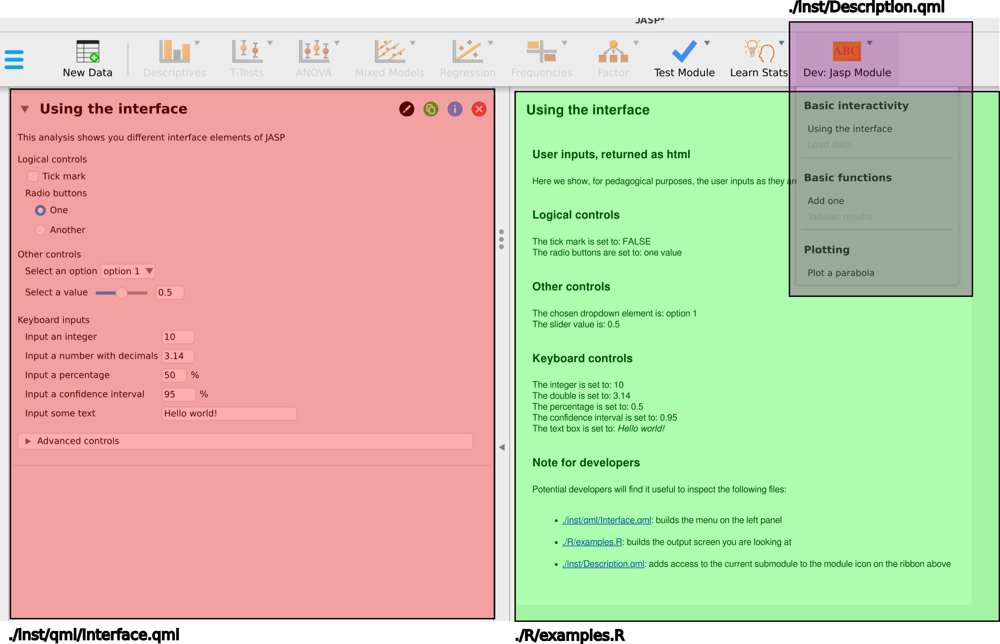

# jaspModuleTemplate

This template repository contains example functionality, which makes it an excellent starting point for developing a new JASP module.
It contains the necessary files and structure, plus a numbers of examples to get started and to understand JASP's internals.

## How to use this repository

1. Fork this template repository to your own GitHub account
2. Clone it to your machine
3. Open JASP and add it as a development module

### For newcomers

It is very illuminating to take a look at our examples **and** at the files that generate them.

For instance, the image below shows the different menus for the _"Using the interface"_ analysis, together with the files that generate them:

### For contributors

Feel free to reuse and adapt to your needs.
Feel also free to remove the ones you don't need.

## Contributing back new module to JASP

Once you have developed your module, you can contribute it back to JASP by creating a pull request.
The JASP team will review your module and provide feedback.
Once your module is accepted, a new repo is created in the JASP organization and your module is added to the JASP module repository.

## Reference

[Tutorial: Development of a JASP module](https://github.com/jasp-stats/jasp-desktop/blob/development/Docs/development/jasp-modules-tutorial.md)
